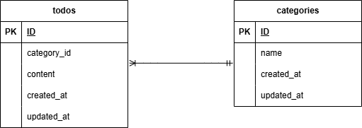

# Todo アプリ

laravel を用いて作成した Todo アプリです。

## 環境構築

#### リポジトリをクローン

```
git clone git@github.com:Estra-Coachtech/laravel-docker-template.git
```

#### Laravel のビルド

```
docker-compose up -d --build
```

#### Laravel パッケージのダウンロード

```
docker-compose exec php bash
```

```
composer install
```

#### .env ファイルの作成

```
cp .env.example .env
```

#### .env ファイルの修正

DB_HOST=mysql
DB_DATABASE=laravel_db
DB_USERNAME=laravel_user
DB_PASSWORD=laravel_pass

#### キー生成

```
php artisan key:generate

```

#### マイグレーション・シーディングを実行

```
php artisan migrate --seed
```

## 使用技術（実行環境）

フレームワーク：laravel

言語：PHP

Web サーバー：Nginx

データベース：MySQL

## ER 図



## URL

アプリケーション：http://localhost

管理画面：なし

phpMyAdmin：http://localhost:8080
